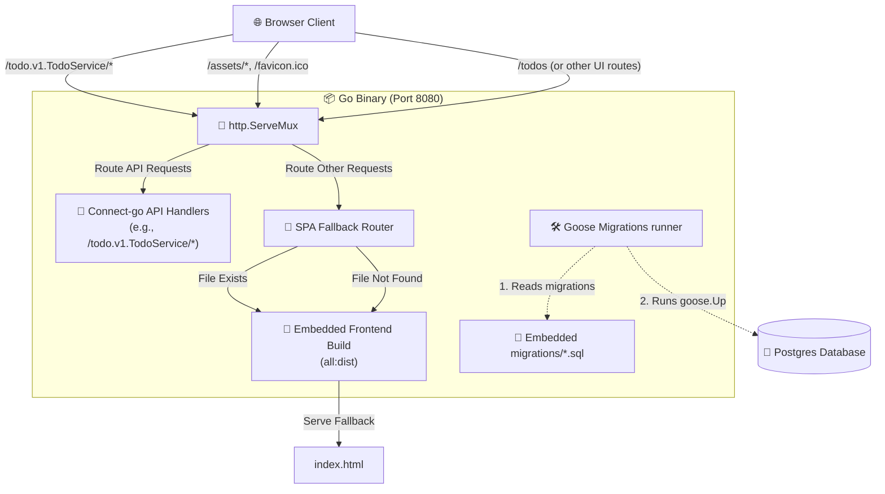

# Embedding React Frontend and Migrations into Go Binary Plan

This plan outlines how to bundle the **Vite React frontend** and the **Goose database migrations** into the **Go backend binary** using Go's standard `embed` package. By serving both the static files and the Connect-go API handlers on the same port and running migrations on startup, we eliminate CORS issues completely and can deploy the entire application as a single, zero-configuration service.

---

## 🏗️ Architecture Overview

The following diagram illustrates how incoming traffic and database setup will be routed by the single Go binary:



---

## 🛠️ Step-by-Step Implementation

### Step 1: Update Frontend API Connection
Currently, `react-frontend/src/helper/use-client.ts` uses a hardcoded `baseUrl` pointing to `http://localhost:8080`. 

When both frontend and backend are served from the same port in production, the frontend should use a relative URL or `window.location.origin` to automatically talk to the same origin. However, in development (`npm run dev`), we still want it to connect to the separate Go backend port.

We will modify [use-client.ts](file:///home/sina/GoProjects/Todo-React-Go/react-frontend/src/helper/use-client.ts) to handle this dynamically:

```typescript
import { useMemo } from "react";
import { type DescService } from "@bufbuild/protobuf";
import { createConnectTransport } from "@connectrpc/connect-web";
import { createClient, type Client } from "@connectrpc/connect";

// In development, target the separate Go port. In production, use the same origin.
const baseUrl = import.meta.env.DEV ? "http://localhost:8080" : window.location.origin;

const transport = createConnectTransport({
    baseUrl: baseUrl,
});

/**
 * Get a promise client for the given service.
 */
export function useClient<T extends DescService>(service: T): Client<T> {
    return useMemo(() => createClient(service, transport), [service]);
}
```

---

### Step 2: Handle the Go `//go:embed` Folder Constraint

> [!IMPORTANT]
> **Go Embed Restriction:** Go's compiler restricts `//go:embed` directives to files within the same directory or subdirectories of the embedding Go file. It **cannot** reference files in parent directories (e.g., `//go:embed ../react-frontend/dist` is illegal).

To solve this cleanly:
1. We will compile the Vite frontend inside `react-frontend/`.
2. Copy the resulting `dist/` directory into `go-backend/dist/`.
3. Perform Go's `//go:embed` inside `go-backend/main.go`.

---

### Step 3: Set Up Embedded Filesystems in Go
In `go-backend/main.go`, we will import the `embed` and `io/fs` packages, embed the `dist` directory, and retrieve the sub-filesystem so the Go app treats the inside of the `dist/` directory as its root.

```go
//go:embed all:dist
var staticFS embed.FS

// In main.go (or helper function):
subFS, err := fs.Sub(staticFS, "dist")
if err != nil {
    log.Fatalf("Failed to create sub-filesystem: %v", err)
}
```

---

### Step 4: Create a Robust SPA Fallback Router in Go
Since Vite React is a Single Page Application (SPA), all routes (e.g., `/todos`, `/settings`) must serve `index.html` so that React Router can handle routing on the client side. If the user requests `/todos` directly or refreshes the page, standard `http.FileServer` would return `404 Not Found`.

We will create a helper SPA handler inside `go-backend/todo-pack/static.go` (or directly inside `main.go`):

```go
package todo

import (
	"io"
	"io/fs"
	"net/http"
	"strings"
)

// NewSPAHandler returns an http.Handler that serves the embedded SPA.
// If a requested file does not exist, it falls back to serving index.html.
func NewSPAHandler(staticFS fs.FS) http.Handler {
	return http.HandlerFunc(func(w http.ResponseWriter, r *http.Request) {
		// Clean leading slash to look up in the embedded FS
		path := strings.TrimPrefix(r.URL.Path, "/")
		if path == "" {
			path = "index.html"
		}

		// Check if the requested file actually exists in the embedded FS
		_, err := fs.Stat(staticFS, path)
		if err != nil {
			// File does not exist, serve index.html as fallback for SPA routing
			indexFile, err := staticFS.Open("index.html")
			if err != nil {
				http.Error(w, "index.html not found", http.StatusInternalServerError)
				return
			}
			defer indexFile.Close()

			stat, err := indexFile.Stat()
			if err != nil {
				http.Error(w, "index.html stat failed", http.StatusInternalServerError)
				return
			}

			w.Header().Set("Content-Type", "text/html; charset=utf-8")
			http.ServeContent(w, r, "index.html", stat.ModTime(), indexFile.(io.ReadSeeker))
			return
		}

		// Otherwise serve with standard FileServer
		http.FileServer(http.FS(staticFS)).ServeHTTP(w, r)
	})
}
```

---

### Step 5: Integrate Static Files in HTTP Routing
We will update `RegisterRoutes` in [routes.go](file:///home/sina/GoProjects/Todo-React-Go/go-backend/todo-pack/routes.go) to accept the embedded filesystem `fs.FS` and mount the SPA handler on the root pattern `"/"`.

```go
// RegisterRoutes registers Connect-go API and embedded static SPA handlers onto the HTTP multiplexer.
func RegisterRoutes(queries *dbgen.Queries, staticFS fs.FS) http.Handler {
	mux := http.NewServeMux()

	// 1. Mount ConnectRPC / gRPC API Endpoint
	connectHandler := NewTodoConnectHandler(queries)
	valInterceptor := validate.NewInterceptor()

	connectPath, connectSvcHandler := todov1connect.NewTodoServiceHandler(
		connectHandler,
		connect.WithInterceptors(valInterceptor),
	)
	mux.Handle(connectPath, connectSvcHandler)

	// 2. Mount Embedded SPA Handler for all other paths
	mux.Handle("/", NewSPAHandler(staticFS))

	// 3. Middleware Chaining (CORS is kept for local Dev but unnecessary in Prod)
	var handler http.Handler = mux
	handler = Logger(handler)
	handler = CORS(handler)

	return handler
}
```

> [!NOTE]
> Go's `http.ServeMux` matches the most specific prefix first. Because the Connect handler path is `/todo.v1.TodoService/`, API requests take precedence. Any other URL matches the root `"/"` and falls back to the SPA static files handler.

---

### Step 6: Embed and Auto-Run Database Migrations
To ensure the database schema is up-to-date immediately upon container startup on the cloud host, we embed the migration SQL files inside `go-backend/db/migrations` and run them on startup using **goose**.

1. **Add Embedded migrations FS in `main.go`:**
   ```go
   //go:embed db/migrations/*.sql
   var embedMigrations embed.FS
   ```

2. **Add `runMigrations` startup execution in `main.go`:**
   ```go
   func runMigrations(dbURL string) {
       log.Println("Running embedded database migrations...")

       db, err := sql.Open("pgx", dbURL)
       if err != nil {
           log.Fatalf("goose: failed to open database connection: %v\n", err)
       }
       defer db.Close()

       goose.SetBaseFS(embedMigrations)

       if err := goose.SetDialect("postgres"); err != nil {
           log.Fatalf("goose: failed to set dialect: %v\n", err)
       }

       if err := goose.Up(db, "db/migrations"); err != nil {
           log.Fatalf("goose: failed to run migrations: %v\n", err)
       }
       log.Println("Database migrations applied successfully!")
   }
   ```

3. We execute `runMigrations(dbURL)` inside `main()` right after establishing a successful database pool ping.

---

### Step 7: Automate the Build Pipeline
We can add a unified build rule to the existing `go-backend/Makefile` or create a new Makefile at the root of `Todo-React-Go` to compile the frontend, copy assets, and build the final Go binary in one command.

Here is the plan for the root `Makefile` (or added to backend `Makefile`):

```makefile
.PHONY: build-frontend build-backend build-all clean

build-frontend:
	cd ../react-frontend && npm run build

copy-static: build-frontend
	rm -rf dist
	cp -r ../react-frontend/dist ./dist

build-backend: copy-static
	go build -o todo-app main.go

build-all: build-backend
	@echo "Build complete! Single binary 'todo-app' created."

clean:
	rm -rf dist todo-app
```

---

## 📈 Key Benefits & Outcomes

1. **Zero CORS Issues:** Serving both the API and frontend on the same port eliminates browser preflight checks and origin restrictions.
2. **Auto Migrating:** The database is migrated automatically on boot. There is no need to run migrations via external tools or entrypoint wrappers in Kubernetes/Docker.
3. **Simplified Deployment:** A single static Go binary can be deployed to AWS, Google Cloud, Docker, or any VPS without needing separate storage (like S3/CloudFront) for frontend files.
4. **No Downtime / Sync Issues:** The frontend and backend versions are tightly coupled in the same binary. A deployment guarantees both are updated simultaneously.
